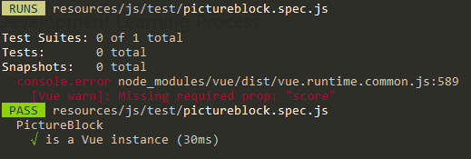
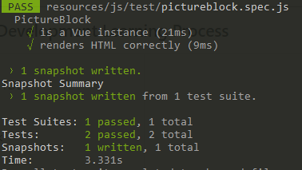

# Demo

I'm gonna use my school project where I had to make a website that hosts a competition to make demo tests in.  
It uses Vue with Laravel so I can test Vue components.

## Set up Laravel to work with vue testing

I mostly followed this [article](https://dev.to/bahdcoder_47/setting-up-jest-in-a-laravel-project-59b7) except that the js folder is not in the assets folder anymore.  
I'll sum it up real quick.

1. `npm i -D jest vue-jest babel-jest @vue/test-utils`  
   or  
   `yarn add -D jest vue-jest babel-jest @vue/test-utils`
2. This tells the jest compiler where to look for the test files and what to use to compile them.

```js
// jest.config.js

module.exports = {
  testRegex: 'resources/assets/js/test/.*.spec.js$',
  moduleFileExtensions: ['js', 'json', 'vue'],
  transform: {
    '^.+\\.js$': 'babel-jest',
    '.*\\.(vue)$': 'vue-jest',
  },
}
```

3. npm run test or tdd to keep it running

```json
// package.json

"scripts": {
    "test": "jest",
    "tdd": "npm run test -- --watch --notify"
}
```

4. Expose the babel config

```js
// .babelrc

{
  "presets": [
    "env"
  ]
}
```

## Test if it's a vue instance

I'm gonna test a simple component that takes 3 props and renders an image block:

```vue
<template>
  <div class="row justify-content-between">
    <div class="col-12 text-center">
      
    </div>
    <div class="col-12 pl-4 text-center align-self-end">
      <h3 class="subheading mt-2">{{ score }}</h3>
      <p v-if="description">{{ description }}</p>
      <slot />
    </div>
  </div>
</template>

<script>
export default {
  name: 'PictureBlock',
  props: {
    filename: {
      type: String,
      required: true,
    },
    score: {
      type: [Number, String],
      required: true,
    },
    description: String,
  },
}
</script>
```

The first test I wrote just tests if it's a vue component. This should always return true.

```js
test('is a Vue instance', () => {
  const wrapper = mount(PictureBlock, {
    propsData: {
      filename: dummyFilename,
      score: '23',
    },
  })
  expect(wrapper.isVueInstance()).toBeTruthy()
})
```

The reason I pass props with this simple test is because I'm using the required parameter inside the component. This is also a form of testing because I get an error message when it doesn't.

**If we don't pass a prop the test will pass but we get an error message.**



## Test if the HTML didn't change

Instead of testing if every line is what we expect it to be, we make a snapshot of the HTML and compare it with a previous snapshot.

```js
test('renders HTML correctly', () => {
  const wrapper = mount(PictureBlock, {
    propsData: {
      filename: dummyFilename,
      score: '23',
    },
  })
  expect(wrapper.element).toMatchSnapshot()
})
```

The first time you run it it takes the snapshot, saves it in `__snapshots__` and passes the test. If you change your html or the test you can [update the snapshot](https://jestjs.io/docs/en/snapshot-testing#updating-snapshots) with `u`



## Check if it uses the props you pass

Let's pass some props and see if they match our expectations.

```js
test('renders props correctly', () => {
  const wrapper = mount(PictureBlock, {
    propsData: {
      filename: dummyFilename,
      description: 'dummy text data',
      score: '23',
    },
  })
  const image = wrapper.find('img')
  const description = wrapper.find('p')
  const score = wrapper.find('h3')

  expect(image.attributes('src')).toBe(`/storage/img/pictures/${dummyFilename}`)
  expect(score.text()).toBe(wrapper.vm.score)
  expect(description.text()).toBe(wrapper.vm.description)
})
```

You can use a lot of ways to find the components you want to test. I mostly went through the [vue test utils wrapper doc](https://vue-test-utils.vuejs.org/api/wrapper/) to find some I could use. You can search on html tag, id or class.

## Don't render optional props we don't pass

We don't pass a description so don't even render the p tag.

```js
test("doesn't render props that aren't passed", () => {
  const wrapper = mount(PictureBlock, {
    propsData: {
      filename: dummyFilename,
      score: '23',
    },
  })
  const description = wrapper.find('p')

  expect(description.exists()).toBe(false)
})
```

## Writing less dummy code in our tests and more tests

[The Vue cookbook real world example](https://vuejs.org/v2/cookbook/unit-testing-vue-components.html#Real-World-Example) explains that we can use a factory function to load in the PictureBlock each time we want to use it:

```js
const factory = (props = {}) => {
  return mount(PictureBlock, {
    propsData: {
      ...props,
    },
  })
}
```

Since filename and score are required anyway, we can better fill those in aswell so we have to write even less code.

```js
const dummyFilename = '123456onetwothree.png'

const factory = description => {
  return mount(PictureBlock, {
    propsData: {
      filename: dummyFilename,
      score: '23',
      ...description,
    },
  })
}
```

now `const wrapper = factory()` will mount the PictureBlock with the required props in it. Sweet!

## What we really should be testing

Just passing a prop and checking if the output is right is actually not a good test to do.  
We should trust vue to render the props correctly. Also if we change any html tags in our code the test will fail.
[Common Tips by Vue Test Utils](https://vue-test-utils.vuejs.org/guides/common-tips.html) explains what we should focus on.

- use shallowMount instead of mount, this doesn't render child components.
- test input and output. So use the tools provided by vue test utils to trigger events.

```js
wrapper.vm.$emit('foo')
wrapper.vm.$emit('foo', 123)

/*
`wrapper.emitted()` returns the following object:
{
  foo: [[], [123]]
}
*/
expect(wrapper.emitted().foo).toBeTruthy()
```

or test a child event

```js
wrapper.find(ChildComponent).vm.$emit('custom')
expect(wrapper.html()).toContain('Emitted!')
```

## Testing API Calls from Vuex

To test and use a plugin like vuex we need to create a local vue state.

```js
import { createLocalVue } from '@vue/test-utils'

// create an extended `Vue` constructor
const localVue = createLocalVue()

// install plugins as normal
localVue.use(MyPlugin)

// pass the `localVue` to the mount options
mount(Component, {
  localVue,
})
```

Or we can test the mutations and getters seperately as if they were normal functions.

The following mutation updates the score of a picture:

```js
upvote(state, { id, score }) {
  let updatedPicture = {
      ...state.pictures[id],
      score,
  }
  Vue.set(state.pictures, id, updatedPicture)
},
```

Since the state is just an object, we can load a fixture in and initialize it:

```js
export default {
  1: {
    filename: '1541424906_5be0470a4575e.png',
    id: 1,
    score: '2',
    user_id: 1,
    description: 'Dummy Text',
  },
}
```

We just load in the functions and the data, pass the current state and then we can test the updated state.

```js
import mutations from '../store/mutations'
import pictureFixture from './fixtures/picture'

describe('Upvote', () => {
  it('adds 1 to the picture score', () => {
    const state = { pictures: pictureFixture }

    mutations.upvote(state, { id: 1, score: '3' })

    expect(state.pictures[1].score).toEqual('3')
  })
})
```
